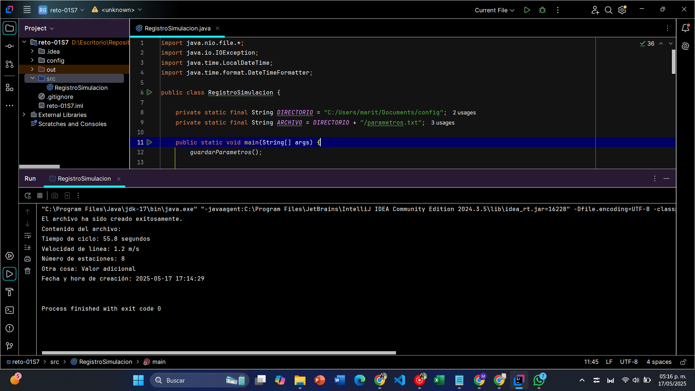
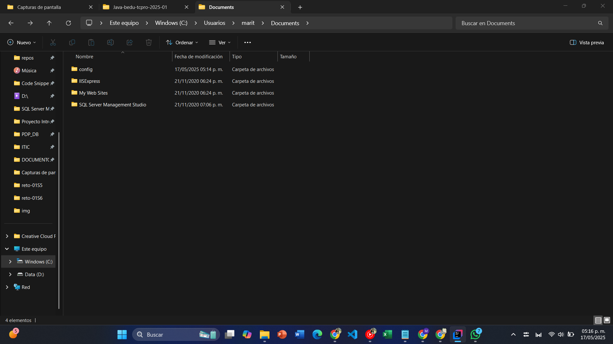
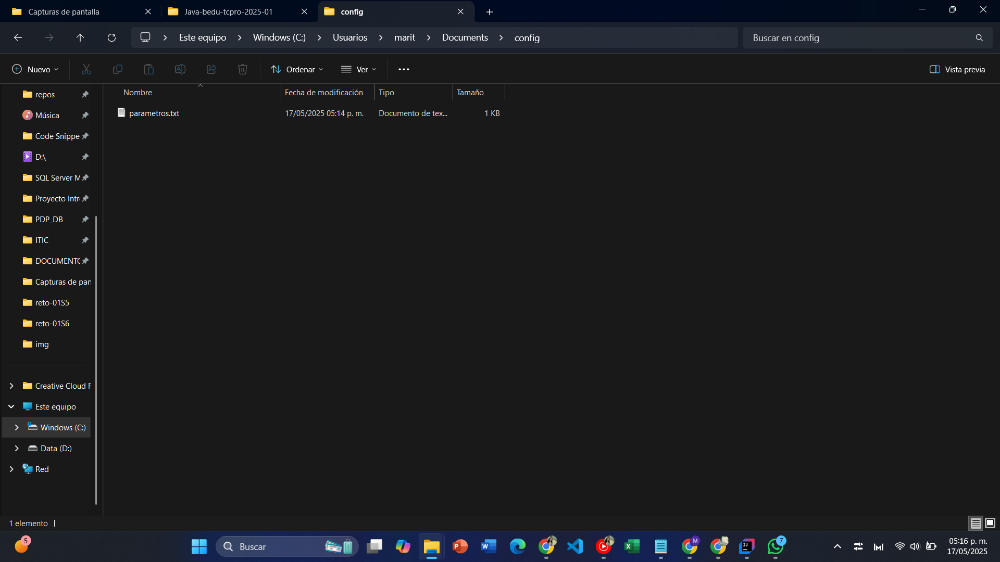
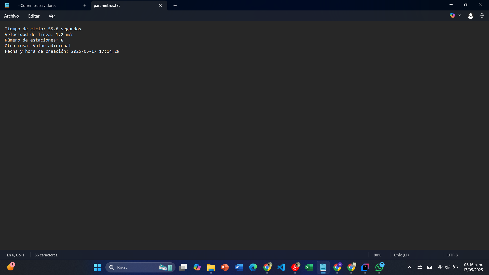

## Documentación de Resultados del RETO 1 de la sesión 7 
#### Simulador de registros usando la API `java.nio.file`

#### Resultado de la ejecución del código y resultado de la consola

#### Muestra de la creación de la carpeta config, la cual si no existia se crea.

#### ARCHIVO parametros.txt dentro del DIRECTORIO /config

#### Datos registrados dentro del ARCHIVO parametros.txt 

