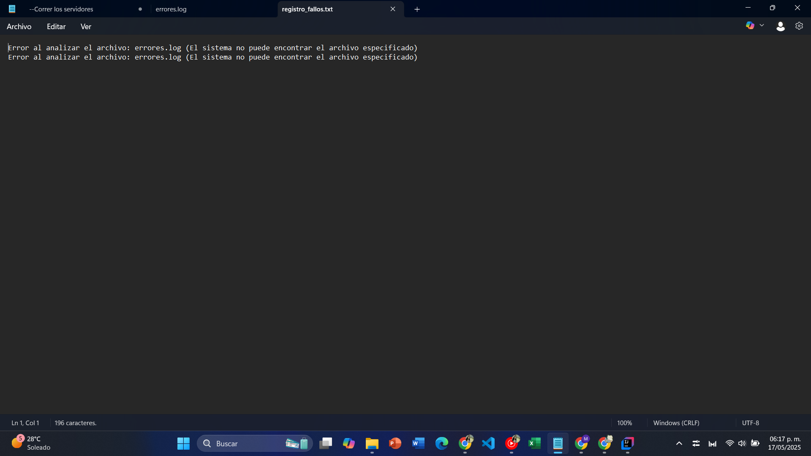
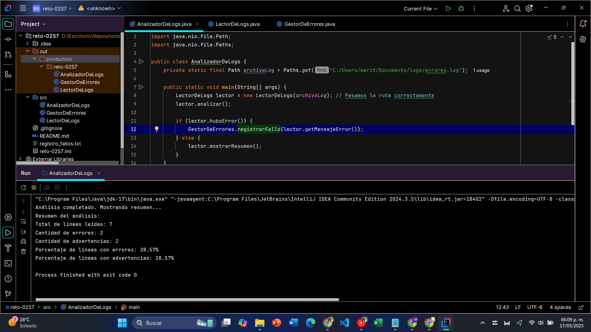

## Documentación de Resultados del RETO 02 de la sesión 7 
### Simulador de registros usando la `Path`
### Se uso una clase principal llamada `AnalizadorDeLogs` y clases auxiliares llamadas `GestorDeErrores` y `LectorDeLogs`

### Resultado de las primeras ejecuciones, al tener un error en la lectura en mi archivo `registro_fallos.txt` se registro lo siguiente

### Una vez de uso una ruta válida para leer un archivo errores.log dentro de la ruta `C:/Users/marit/Documents/logs/errores.log` (ruta personalizada de mi sistema), se hizo en ánalisis correspondiente obteniendo los siguientes resultados

